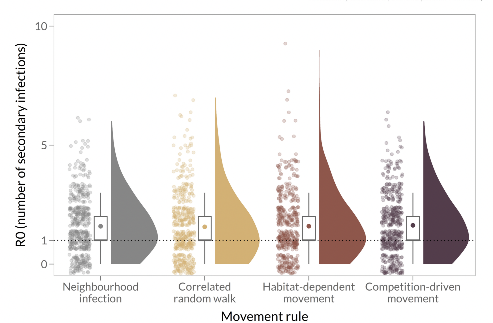

```{r setup, include=FALSE}
options(htmltools.dir.version = FALSE)
knitr::opts_chunk$set(
  fig.width=9, fig.height=3.5, fig.retina=3,
  out.width = "100%",
  cache = FALSE,
  echo = TRUE,
  message = FALSE, 
  warning = FALSE,
  hiline = TRUE
)


library(knitr)

library(RefManageR)
library(bibtex)
BibOptions(check.entries = FALSE,
           bib.style = "authoryear",
           cite.style = "alphabetic",
           style = "markdown",
           hyperlink = FALSE,
           dashed = FALSE)
bib <- ReadBib("bibliography-visualisation.bib", check = FALSE)

library(readr)
library(here)
library(dplyr)
library(tidyr)
library(lubridate)
library(ggplot2)
library(viridisLite)
library(forcats)
library(maps)
library(gghighlight)
library(cowplot)

covid_data_clean <- read_tsv(here("data", "covid_data_clean.tsv"))

countries <- c("United Kingdom",
               "Germany",
               "Sweden",
               "Croatia",
               "United States of America",
               "Canada",
               "Mexico",
               "Brazil",
               "Chile",
               "Colombia",
               "Bolivia",
               "South Africa",
               "Kenya",
               "Morocco",
               "Nigeria",
               "India",
               "South Korea",
               "Australia",
               "China"
               )

countries2 <- c("United Kingdom",
               "Sweden",
               "United States of America",
               "Canada",
               "Mexico",
               "Chile",
               "Colombia",
               "South Africa",
               "Kenya",
               "Morocco",
               "Nigeria",
               "South Korea",
               "Australia",
               "China"
               )

options(scipen=999)

#TODO: add alt text for all images and figures
#TODO: add references:citation for the `viridisLite` package and the `ggplot2` package?
```

# Summary of session 3: Data wrangling with `dplyr` and `tidyr`

- `r emo::ji("white_check_mark")` Subset columns or rows with `select` or `filter` and create new columns with `mutate`.
- `r emo::ji("white_check_mark")` Link the output of one function to the input of another function with the ‘pipe’ operator `%>%`.
- `r emo::ji("white_check_mark")` Combine datasets using `join`.
- `r emo::ji("cross_mark")` Reshape a dataframe from long to wide format with the `pivot_wider` function.
- `r emo::ji("cross_mark")` Export a dataframe to a .csv and .tsv file.

---

# Learning objectives: Data visualisation with `ggplot2`

- `r emo::ji("white_check_mark")` Produce scatter plots, boxplots, and barplots using ggplot.
- `r emo::ji("white_check_mark")` Set universal plot settings.
- `r emo::ji("white_check_mark")` Describe what faceting is and apply faceting in ggplot.
- `r emo::ji("white_check_mark")` Modify the aesthetics of an existing ggplot plot (including axis labels and colour).
- `r emo::ji("white_check_mark")` Build complex and customized plots from data in a data frame.

---

# Why `ggplot2`?


```{r ggplot, echo = FALSE}
world_map <- map_data("world")

covid_data_small <- covid_data_clean %>% 
  filter(to_date == "2022-06-12") %>% 
  select(region = country, cases_rate)

covid_map_data <- left_join(world_map, covid_data_small, by = "region")

map_plot <- covid_map_data %>% 
  ggplot(aes(long, lat, group = group))+
  geom_polygon(aes(fill = cases_rate ), color = "white")+
  scale_fill_viridis_c()

scatter_plot <- covid_data_clean %>% 
  ggplot(aes(x = cases_count, y = deaths_count)) +
  geom_point() +
  geom_smooth() +
  facet_wrap(~year)

line_plot <- covid_data_clean %>%
  filter(country %in% countries, year == 2021) %>% 
  ggplot(aes(x = to_date, y = cases_count, colour = country)) +
  geom_line() +
  theme_minimal() +
  scale_colour_viridis_d() +
  labs(x = "",
       y = "") +
  theme(legend.position = "none")

bar_plot <- covid_data_clean %>% 
  drop_na() %>% 
  filter(country %in% countries2,
         year == 2020) %>% 
  group_by(country) %>% 
  summarise(deaths_year = sum(deaths_count)) %>%
  ungroup() %>% 
  mutate(country = as.factor(country),
         country = fct_reorder(country, deaths_year)) %>%
  ggplot(aes(x = country, y = deaths_year)) +
  geom_col() +
  gghighlight(max(deaths_year) > 150000) +
  coord_flip() +
  labs(x = "",
       y = "Total deaths in 2020") +
  theme_minimal()

plot_grid(bar_plot,
          map_plot,
          line_plot,
          scatter_plot,
          label_size = 12)

```

---
class: center, middle

# `ggplot2`


[**ggplot2**](https://ggplot2.tidyverse.org/) is a package (included in **tidyverse**) for creating highly customisable plots that are built step-by-step by adding layers.

The separation of a plot into layers allows a high degree of flexibility with minimal effort. `r NoCite(bib, "ggplot2")`

---
# `ggplot2` layers

.pull-left[
```r
<DATA> %>%
    ggplot(aes(<MAPPINGS>)) +
    <GEOM_FUNCTION>() +
    <CUSTOMISATION>
```
]

--

.pull-right[


.footnote[Artwork by [Allison Horst](https://allisonhorst.com/), reused under a CC-BY licence.]
]

---

class: center, middle, inverse

# Data visualisation crash-course


---

# Aesthetics

> Whenever we visualise data, we take data values and convert them in a systematic and logical way into the visual elements that make up the final graphic. [...] All data visualisations map data values into quantifiable features of the resulting graphic. We refer to these features as **aesthetics**.

.footnote[Quote from Claus Wilke's [*Fundamentals of Data Visualization*](https://clauswilke.com/dataviz).
`r NoCite(bib, "wilke_2019")`]

--

## Commonly-used aesthetics

.pull-left[
- position (*x* and *y* coordinates),
- colour
]

.pull-right[
- size
- shape
- line type
]

---
class: middle

# Find the green dot lvl. 1 `r emo::ji("baby")`


```{r create-data, echo = FALSE}
plot1 <- data.frame(x = rnorm(100, 10, 1),
                    y = rnorm(100, 10, 1),
                    z = c(rep("a", 99), "b"))
plot2 <- data.frame(x = rnorm(100, 10, 1),
                    y = rnorm(100, 10, 1),
                    z = c(rep("b", 99), "a"))
plot3 <- data.frame(x = rnorm(100, 10, 1),
                    y = rnorm(100, 10, 1),
                    z = c(rep("a", 33), rep("b", 66), rep("a", 1)),
                    aa = c(rep("a", 66), rep("b", 34)))
```


```{r green-dot1, echo = FALSE}
plot1 %>%
  ggplot(aes(x = x, y = y, colour = z)) +
  geom_point(size = 2.5) +
  scale_colour_manual(values=c("tomato", "#7aeb7a")) +
  labs(x = "", y = "", title = "Colour only, N = 100") +
  theme(legend.position = "none",
        plot.title = element_text(size=22),
        axis.text = element_blank(),
        axis.ticks = element_blank())
```

.footnote[Inspired by Kieran Healy's [*Data Visualization: A practical introduction*](https://socviz.co/). `r NoCite(bib, "healy_2018")`]

---
class: middle

# Find the green dot lvl. 2 `r emo::ji("graduate")`


```{r green-dot2, echo = FALSE}
plot2 %>%
  ggplot(aes(x = x, y = y, shape = z)) +
  geom_point(colour = "#7aeb7a", size = 2.5) +
  labs(x = "", y = "", title = "Shape only, N = 100") +
  theme(legend.position = "none",
        plot.title = element_text(size=22),
        axis.text = element_blank(),
        axis.ticks = element_blank())
```

.footnote[Inspired by Kieran Healy's [*Data Visualization: A practical introduction*](https://socviz.co/). `r NoCite(bib, "healy_2018")`]

---
class: middle

# Find the green dot lvl. 3 `r emo::ji("alien")`

```{r green-dot3, echo = FALSE}
plot3 %>%
  ggplot(aes(x = x, y = y, shape = z, colour = aa)) +
  geom_point(size = 2.5) +
  scale_colour_manual(values=c("tomato", "#7aeb7a")) +
  labs(x = "", y = "", title = "Colour and Shape, N = 100") +
  theme(plot.title = element_text(size=22),
        legend.position = "none",
        axis.text = element_blank(),
        axis.ticks = element_blank())
```

.footnote[Inspired by Kieran Healy's [*Data Visualization: A practical introduction*](https://socviz.co/). `r NoCite(bib, "healy_2018")`]


---

# Colour considerations

In the previous game, people with the most common type of colour-blindness would have struggled to perceive the colour distinction!


---

# Viridis palettes


.pull-left[

Are relatively colourblind-friendly...

```{r viridis, echo = FALSE, out.height = "50%"}
n = 200

image(
1:n, 1, as.matrix(1:n),
col = viridis(n),
xlab = "",
ylab = "",
xaxt = "n",
yaxt = "n"
)
title(main = "viridis")
```

```{r inferno, echo = FALSE, out.height = "50%"}
image(
1:n, 1, as.matrix(1:n),
col = inferno(n),
xlab = "",
ylab = "",
xaxt = "n",
yaxt = "n"
)
title(main = "inferno")
```


]

--

.pull-right[

... and they're pretty `r emo::ji("smiling cat face with heart-eyes")`

```{r viridis-plot, echo = FALSE, fig.dim = c(3.5, 3.5)}
library(hexbin)

dat <- data.frame(x = rnorm(10000), y = rnorm(10000))
ggplot(dat, aes(x = x, y = y)) +
  geom_hex() + coord_fixed() +
  scale_fill_gradientn(colours = viridis(256, option = "D")) +
  labs(x = "", y = "")
```
]

.footnote[from the [`viridisLite` site](https://sjmgarnier.github.io/viridisLite/reference/viridis.html) by Simon Garnier] `r NoCite(bib, "viridisLite")`

---

class: center, middle, inverse

# Data visualisation exercises

---
class: center, middle

# Exercise 1

`r emo::ji("clock")` **5 mins**

Filter the `covid_data_clean` dataset to contain only observations froms Denmark and Sweden for the year 2020 and then create a line plot of the `cases_rate` by `to_date` with the `country` showing in different colours.

`r countdown::countdown(minutes = 5, color_running_background  = "lightgreen", color_running_text = "black", color_finished_background = "red", color_finished_text =  "grey30")`

---
class: center, middle, inverse

# Exercise 1: Solution

```{r exercise-1-sol, out.width="85%", fig.cap="Line plot showing the case rate of COVID cases for Denmark and Sweden in 2020. They're both fairly low until October when they start ticking up with Sweden surpassing 400 cases per 100,000 people approximately in December 2020, when Denmark is at about 300 cases per 100,000 people."}
covid_data_clean %>%
  filter(country == "Denmark" | country == "Sweden", year  == 2020) %>% 
  ggplot(aes(x = to_date, y = cases_rate, colour = country)) +
  geom_line(size = 1.2) +
  scale_colour_viridis_d()
```


---
class: center, middle, inverse

# Exercise 2

`r emo::ji("clock")` **10 mins**

Create a (flipped) bar chart that shows the total death count for 2020 for the countries we selected and orders them from the highest death toll to the lowest.

`r countdown::countdown(minutes = 10, color_running_background  = "lightgreen", color_running_text = "black", color_finished_background = "red", color_finished_text =  "grey30")`

--

**Added challenge**: do the same but showing the years 2020, 2021, and 2022 in facets (using `facet_wrap()`).

---
class: center, middle, inverse

# Exercise 2: Solution (code)

```{r exercise-2-sol-code, fig.show = 'hide'}

covid_data_clean %>% 
  drop_na() %>% 
  filter(country %in% countries,
         year == 2020) %>% 
  group_by(country) %>% 
  summarise(deaths_year = sum(deaths_count)) %>%
  ungroup() %>% 
  mutate(country = as.factor(country),
         country = fct_reorder(country, deaths_year)) %>%
  ggplot(aes(x = country, y = deaths_year)) +
  geom_col() +
  coord_flip()

```

---
class: center, middle, inverse

# Exercise 2: Solution (plot)

```{r exercise-2-sol-plot, echo = FALSE}

covid_data_clean %>% 
  drop_na() %>% 
  filter(country %in% countries,
         year == 2020) %>% 
  group_by(country) %>% 
  summarise(deaths_year = sum(deaths_count)) %>%
  ungroup() %>% 
  mutate(country = as.factor(country),
         country = fct_reorder(country, deaths_year)) %>%
  ggplot(aes(x = country, y = deaths_year)) +
  geom_col() +
  coord_flip()

```

---
class: center, middle, inverse

# Exercise 2 bonus: Solution (code)

```{r exercise-2-sol-bonus-code, fig.show = 'hide'}

covid_data_clean %>% 
  drop_na() %>% 
  filter(country %in% countries) %>% 
  group_by(country, year) %>% 
  summarise(deaths_year = sum(deaths_count)) %>%
  ungroup() %>% 
  mutate(country = as.factor(country),
         country = fct_reorder(country, deaths_year)) %>%
  ggplot(aes(x = country, y = deaths_year)) +
  geom_col() +
  coord_flip() +
  facet_wrap(~year)

```

---
class: center, middle, inverse

# Exercise 2 bonus: Solution (plot)

```{r exercise-2-sol-bonus-plot, echo = FALSE}

covid_data_clean %>% 
  drop_na() %>% 
  filter(country %in% countries) %>% 
  group_by(country, year) %>% 
  summarise(deaths_year = sum(deaths_count)) %>%
  ungroup() %>% 
  mutate(country = as.factor(country),
         country = fct_reorder(country, deaths_year)) %>%
  ggplot(aes(x = country, y = deaths_year)) +
  geom_col() +
  coord_flip() +
  facet_wrap(~year)

```

---

class: center, middle, inverse

# Data visualisation crash-course continued

---

# The problem with bar plots


.footnote[Image from [*Beyond Bar and Line Graphs: Time for a New Data Presentation Paradigm*](https://doi.org/10.1371/journal.pbio.1002128) by Weissgerber, Milic, Winham, & Garovic (2015), reused and adapted under a [CC-BY 4.0 licence](https://creativecommons.org/licenses/by/4.0/).] `r NoCite(bib, "weissgerber_2015")`

---

# A better way: Raincloud plots!

```{r, echo=FALSE, out.width = "67%", fig.cap="Four raincloud plots, each of which consists of a density plot (the cloud) to illustrate the distribution, a scatterplot (the rain) to illustrate the raw data and a boxplot between the two for further information on central tendency.", fig.align='center'}


```

.footnote[Plot created by [Cedric Scherer](https://www.cedricscherer.com/2021/06/06/visualizing-distributions-with-raincloud-plots-and-how-to-create-them-with-ggplot2/) and reused under a [CC-BY licence](https://creativecommons.org/licenses/by/4.0/).)]


---
class: center, middle, inverse

# Exercise 3

`r emo::ji("clock")` **5 mins**

Build the previous plot again and experiment with at least two themes.

Which do you like best?

.pull-left[
`theme_minimal`  
`theme_void`  
`theme_classic`  
]
.pull-right[
`theme_dark`  
`theme_grey`  
`theme_light`
]


`r countdown::countdown(minutes = 5, color_running_background  = "lightgreen", color_running_text = "black", color_finished_background = "red", color_finished_text =  "grey30")`


---
class: center, middle, inverse

# Exercise 3: My preference

I prefer the white background of `theme_minimal` and I like that it retains the major grid, though that's slightly controversial.

I also likes that it gets rid of the black box around the plot.

---

## This is just the beginning!

`ggplot2` and compatible packages give you a huge amount of flexibility to create *exactly* the graph you want!

You can explore packages that let you play around with:
- beautiful palettes (e.g. `ghibli`, `wesanderson`),
- new themes (e.g. `hrbrthemes`)
- additional fonts (e.g. `extrafont`)
- animated graphs (e.g. `gganimate`)
- and so much more!

There are more resources for you to explore in the HackMD `r emo::ji("sparkles")`

---
# References

```{r references, results='asis', echo=FALSE}
PrintBibliography(bib)
```

---
class: center, middle

# Thank you for your attention `r emo::ji("sparkles")` `r emo::ji("pray")`

## See you next week for literate programming with `R Markdown` `r emo::ji("book")`
