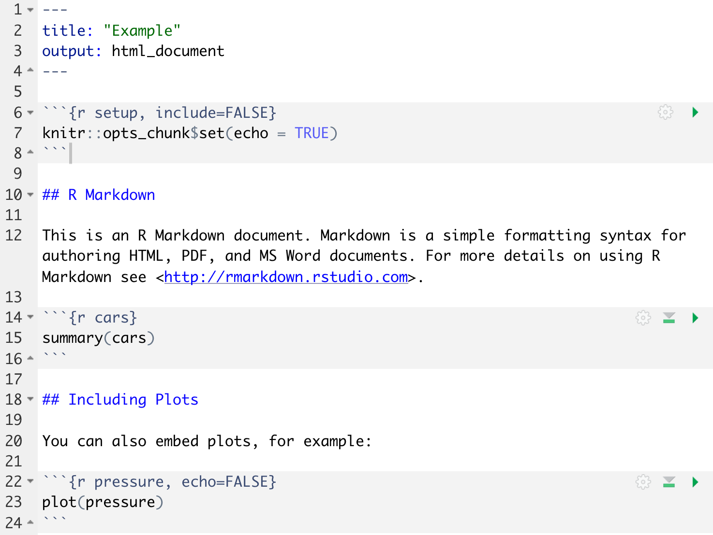
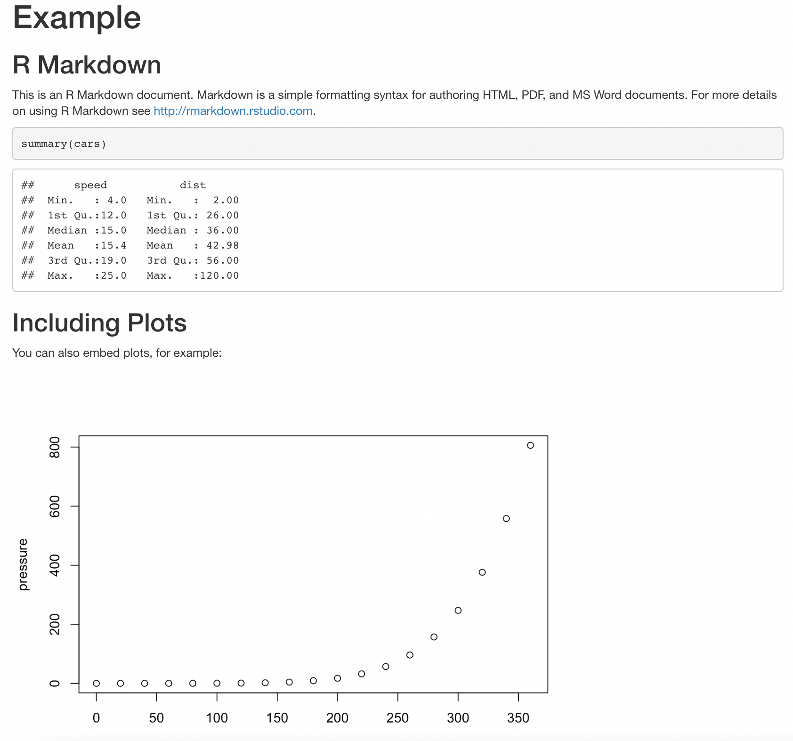
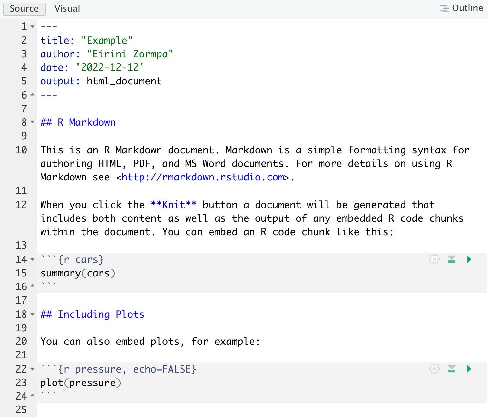

```{r setup, include=FALSE}
options(htmltools.dir.version = FALSE)
knitr::opts_chunk$set(
  fig.width=9, fig.height=3.5, fig.retina=3,
  out.width = "100%",
  cache = FALSE,
  echo = TRUE,
  message = FALSE, 
  warning = FALSE,
  hiline = TRUE
)

library(knitr)
library(readr)
library(here)

```

# Summary of session 4: Data visualisation with `ggplot2`

- `r emo::ji("white_check_mark")` Create line plots, scatter plots, and bar plots using `ggplot2`.
- `r emo::ji("white_check_mark")` Apply faceting in `ggplot2`.
- `r emo::ji("white_check_mark")` Build complex and customized plots from data in a data frame.

---
class: center, middle

# Any questions?

---

# Learning objectives: Literate programming with `R Markdown`

- `r emo::ji("white_check_mark")` Describe what literate programming is and explain why it is useful
- `r emo::ji("white_check_mark")` Create a `.Rmd` document containing R code, text, and plots
- `r emo::ji("white_check_mark")` Understand basic syntax of (R) Markdown
- `r emo::ji("white_check_mark")` Customise code chunks to control formatting

---

# What is literate programming?

With literate programming, we can combine (nicely formatted!) narrative text with code, and code output all in the same document.

--

`R Markdown` is one example of such a document, but you may have also heard of Jupyter notebooks, which do something similar.

--

I love `R Markdown` documents because 1. they are reproducible  and 2. they are extremely versatile.

---

# Example of an `R Markdown` document

.pull-left[

```{r, echo=FALSE, fig.cap="Visualisation of the R Markdown flow.", fig.align='center'}


```

]

--

.pull-right[

```{r, echo=FALSE, fig.cap="Visualisation of the R Markdown flow.", fig.align='center', out.width="83%"}


```

]


---

# Why `R Markdown`: reproducibility `r emo::ji("recycle")`

By combining text, code, and code output in the same document:

- it's easier to **document** your data cleaning and analysis, helping you and other understand your work

--
- it's easier to **avoid copy-paste errors**

--
- it's easier to **update your manuscript** if you collect more data or change your data cleaning 

--
- because `.Rmd` files are plain text files, they are compatible with version control systems, such as `git`. 

---

# Why `R Markdown`: versatility

```{r, echo=FALSE, fig.cap="Visualisation of the R Markdown flow.", fig.align='center', out.width="50%"}

knitr::include_graphics("https://raw.githubusercontent.com/datacarpentry/r-socialsci/main/fig/rmd-rmd_to_html.png")
```

--

## Outputs

You can create different kinds of documents from R Markdown: **reports**, **slides** (like these ones!), journal **papers**, interactive **web apps**!

---

# Anatomy of an `R Markdown` document

.pull-left[

```{r, echo=FALSE, fig.cap="Visualisation of the R Markdown flow.", fig.align='center'}


```

]


.pull-right[

1. YAML header
2. Markdown text
3. Code chunks (supports R, Python, Stan, etc.)

]

---

# `here` for relative paths

```{r, echo=FALSE, fig.cap="A cartoon showing two paths side-by-side. On the left is a scary spooky forest, with spiderwebs and gnarled trees, with file paths written on the branches like “~/mmm/nope.csv” and “setwd(“/haha/good/luck/”), with a scared looking cute fuzzy monster running out of it. On the right is a bright, colorful path with flowers, rainbow and sunshine, with signs saying “here!” and “it’s all right here!” A monster facing away from us in a backpack and walking stick is looking toward the right path. Stylized text reads “here: find your path.", out.width="50%", fig.align='center'}

knitr::include_graphics("https://raw.githubusercontent.com/allisonhorst/stats-illustrations/main/rstats-artwork/here.png")
```

.footnote[Artwork by [Allison Horst](https://allisonhorst.com/), reused under a CC-BY licence.]

---

# Customising chunk output

There are options available to customise how the code-chunks are presented in the output document.
The options are entered in the code chunk after `chunk-name`and separated by commas, e.g. `{r chunk-name, eval = FALSE, echo = TRUE}`.

| Option | Output |
|--------|--------|
| `eval` | Whether or not the code within the code chunk should be run. |
| `echo` | Whether the code chunk will appear in the output document. |
| `include` | Whether if the output of a code chunk should be included in the document.|
| `warning` | Whether the output document will contain warning messages. |
| `message` | Whether the output document will display messages. |
| `fig.align` | Where the figure from your R code chunk should be positioned on the page.


---
class: center, middle, inverse

# Exercise 1

Play around with the different options in the previous code chunk, and re-**Knit** to see what each option does to the output.

What happens if you use `eval = FALSE` and `echo = FALSE`? What is the difference between this and `include = FALSE`? 

---
class: inverse

# Writing papers in `R Markdown`

1. Install `tinytex` to install a LaTeX distribution, if you don't already have one
    - load `tinytex` and then run the command `tinytex::install_tinytex()`
2. Install `rticles`
3. Create a new R Markdown file `From template` and select `Journal of Open Source Software article`

---

# `Quarto`: The future of `R Markdown`

```{r, echo=FALSE, fig.cap="A schematic representing the multi-language input (e.g. Python, R, Observable, Julia) and multi-format output (e.g. PDF, html, Word documents, and more) versatility of Quarto.", out.width="90%", fig.align='center'}


knitr::include_graphics("https://raw.githubusercontent.com/allisonhorst/stats-illustrations/main/julie-mine-quarto-keynote/quarto_schematic.png")
```

.footnote[Artwork by [Allison Horst](https://allisonhorst.com/), reused under a CC-BY licence.]


---
class: center, middle

# Thank you for your attention and participation throughout this workshop series`r emo::ji("sparkles")` `r emo::ji("pray")`

